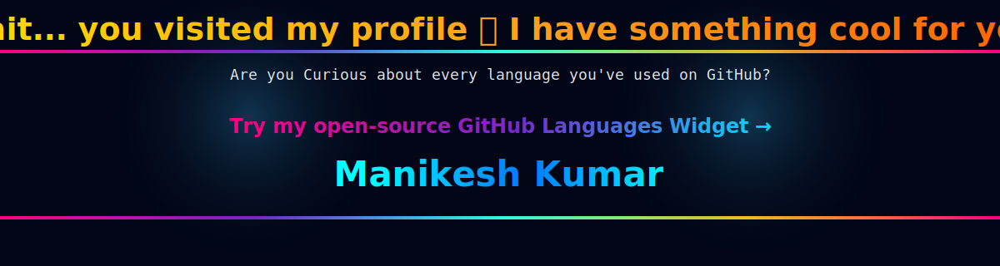

  

  

---

# 👨‍💻 About Me  
💻 Intern @ **IIT Delhi** 
🔬 Former Intern @ **IIT Dharwad**  
🎓 B.Tech in **Data Science & Artificial Intelligence** @ *IIIT Dharwad*  
🌱 Currently Learning **Generative AI, Agentic AI, XAI, React, JavaScript**  

🏆 **Achievements**  
- Top 20 in India — National **Analog Design Hackathon (C2S)**  
- 2nd Prize — **AI & VLSI Hackathon** @ IIIT Dharwad  

# 🔧 Tech Stack

### **Languages**

### **Web Development**

### **AI / ML**

### **Tools**

# 📊 GitHub Stats

  <picture>
    <source media="(prefers-color-scheme: dark)" srcset="https://raw.githubusercontent.com/manikeshmk/manikeshmk/output/github-contribution-grid-snake-dark.svg">
    <source media="(prefers-color-scheme: light)" srcset="https://raw.githubusercontent.com/manikeshmk/manikeshmk/output/github-contribution-grid-snake.svg">
    
  </picture>

  
  

 

  

 
# 👀 Profile Views 

  

# 🌐 Live Websites Portfolio  

  <i>Explore my deployed products, experiments, and interactive web experiences</i>

<!-- WEBSITE-LINKS-START -->

<!-- WEBSITE-LINKS-END -->

# 📫 Connect With Me  

